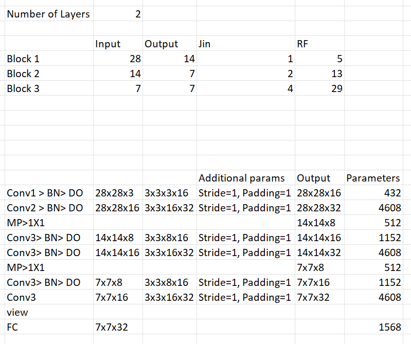
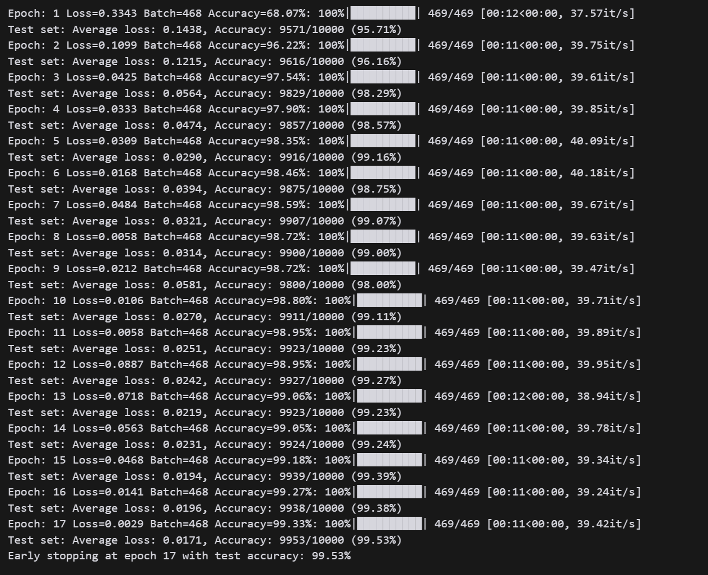

# MNIST CNN Model Architecture- TSAI ERA V3 Session 6 Assignment


This repository contains a CNN model implementation for the MNIST dataset with specific architectural requirements and constraints.

## Model Architecture

### Conceptual Understanding

Before starting with the model, I took time to understand the components of CNN and built a conceptual architecture of the model in excel, as shown by Rohan sir in the session.



The parameter counts are not accurate, but it gives a good understanding of the model.

### Final Model Architecture

The CNN model is structured with the following key components:

### Layer Structure 

```
----------------------------------------------------------------
        Layer (type)               Output Shape         Param #
================================================================
            Conv2d-1           [-1, 16, 28, 28]             160
              ReLU-2           [-1, 16, 28, 28]               0
       BatchNorm2d-3           [-1, 16, 28, 28]              32
           Dropout-4           [-1, 16, 28, 28]               0
            Conv2d-5           [-1, 32, 28, 28]           4,640
              ReLU-6           [-1, 32, 28, 28]               0
       BatchNorm2d-7           [-1, 32, 28, 28]              64
           Dropout-8           [-1, 32, 28, 28]               0
         MaxPool2d-9           [-1, 32, 14, 14]               0
           Conv2d-10            [-1, 8, 14, 14]             264
           Conv2d-11           [-1, 16, 14, 14]           1,168
             ReLU-12           [-1, 16, 14, 14]               0
      BatchNorm2d-13           [-1, 16, 14, 14]              32
          Dropout-14           [-1, 16, 14, 14]               0
           Conv2d-15           [-1, 32, 14, 14]           4,640
             ReLU-16           [-1, 32, 14, 14]               0
      BatchNorm2d-17           [-1, 32, 14, 14]              64
          Dropout-18           [-1, 32, 14, 14]               0
        MaxPool2d-19             [-1, 32, 7, 7]               0
           Conv2d-20              [-1, 8, 7, 7]             264
           Conv2d-21             [-1, 16, 7, 7]           1,168
             ReLU-22             [-1, 16, 7, 7]               0
      BatchNorm2d-23             [-1, 16, 7, 7]              32
          Dropout-24             [-1, 16, 7, 7]               0
           Conv2d-25             [-1, 32, 7, 7]           4,640
             ReLU-26             [-1, 32, 7, 7]               0
           Linear-27                   [-1, 10]             330
================================================================
Total params: 17,498
Trainable params: 17,498
Non-trainable params: 0
----------------------------------------------------------------
Input size (MB): 0.00
Forward/backward pass size (MB): 1.56
Params size (MB): 0.07
Estimated Total Size (MB): 1.63
----------------------------------------------------------------
```

### Key Components

✅ **Architectural Features**:
- Batch Normalization layers for training stability
- Dropout layers for regularization
- Fully Connected/Global Average Pooling for final classification
- OneCycleLR scheduler for optimized learning rate control

### Model Statistics

The model includes:
- Total Parameters: 17,498
- Input Shape: (1, 28, 28)
- Output Shape: (10)

## Testing Result logs

This model is trained and tested in the `mnist_working_model.py` file. 

An accuracy of **99.53%** was achieved on the test dataset in **17** epochs. Early stopping was used to prevent overfitting.



## Requirements
The CNN model has been successfully built with the following requirements:
- Total Parameters: (<20,000) : 17,498 ✅
- Testing accuracy: (>99.4%) : 99.53% ✅
- Number of Epochs: (<20) : 17 ✅
- Have used Batch Normalization ✅
- Have used Dropout ✅
- Have used FC Layer or GAP for final classification ✅   

## Quality Checks

The model is continuously validated through GitHub Actions to ensure it maintains:

1. Non-zero parameter count
2. Presence of Batch Normalization
3. Implementation of Dropout
4. Proper classification head (Fully Connected Layer)

## Model Validation

To run the architecture validation checks locally:

```
python model_checks.py
```

This will verify all architectural requirements and display the results.

## Requirements

- torch
- torchvision
- Additional dependencies in `requirements.txt`

## GitHub Actions

This project uses GitHub Actions for automated validation of the model architecture. The workflow is triggered on:

- Push events to `mnist_working_model.py`, `model_checks.py`, or workflow files
- Pull requests affecting model files
- Manual workflow dispatch

The workflow:
1. Sets up Python 3.8 environment
2. Installs required dependencies
3. Runs model architecture validation checks
